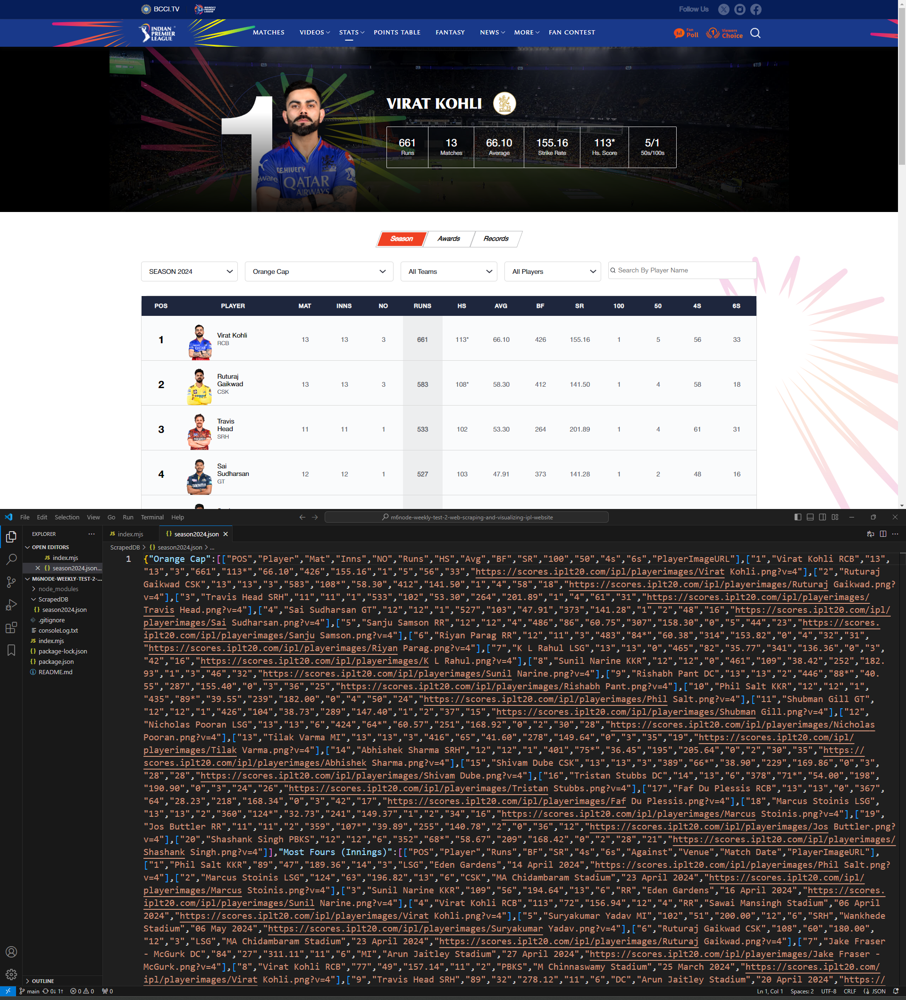

# IPL data scraping Project (Weekly Test-2, Module #6, MERN Stack)


## Description:
in the assignment i have scraped the data from IPL ```https://www.iplt20.com/stats/2024``` using [puppeteer](https://pptr.dev/) and [NodeJS](https://nodejs.org/en/) and stored it into json file.
following data is begin fetched :
+ players who deserves orange cap in each season with their runs
+ players who hit most 4's in each season
+ players who hit most 6's in each season
+ players who hit most centuries in each season
+ players who hit most 50's in each season

## How execute express server on yours local machine
```bash
npm i
node index.mjs
```
## Location of JSON file containg scraped Data
```bash
ScrapedDB\season2024.json
```

## Tech. Stack Used:
+ [NodeJS](https://nodejs.org/en/)
+ [ExpressJS](https://expressjs.com/)
 
## Author
[Abhishek kumar](https://www.linkedin.com/in/alex21c/), ([Geekster](https://geekster.in/) MERN Stack FS-14 Batch)


  
  


